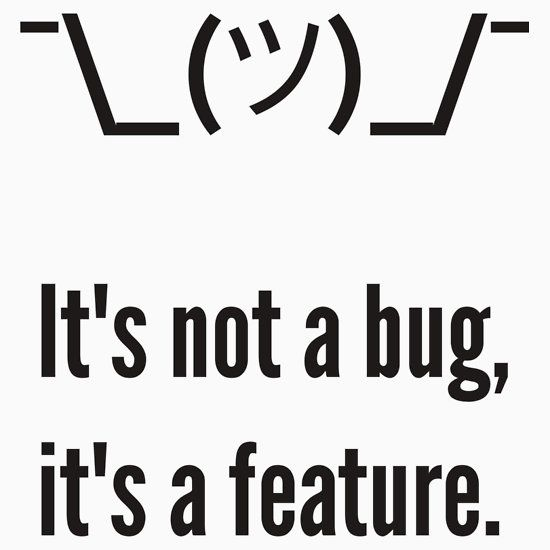

# Other options

Lets look what other options are there besides apache beam

1.[ ksqldb](https://docs.ksqldb.io/en/latest/concepts/time-and-windows-in-ksqldb-queries/#window-types)

This one also has all three types of windows, but some are under
another name.
Fixed windows are called Tumbling here, and Sliding are called
Hopping.

It doesn't have watermarks or Triggers, so the results are updated
whenever there are updates[.](https://www.confluent.io/blog/kafka-streams-take-on-watermarks-and-triggers/)

2. IBM streams

it has tumbling and sliding windows[.](https://www.ibm.com/docs/en/streams/4.1.0?topic=implementation-window-handling) no mention of session ones

It also has watermarks and triggers
