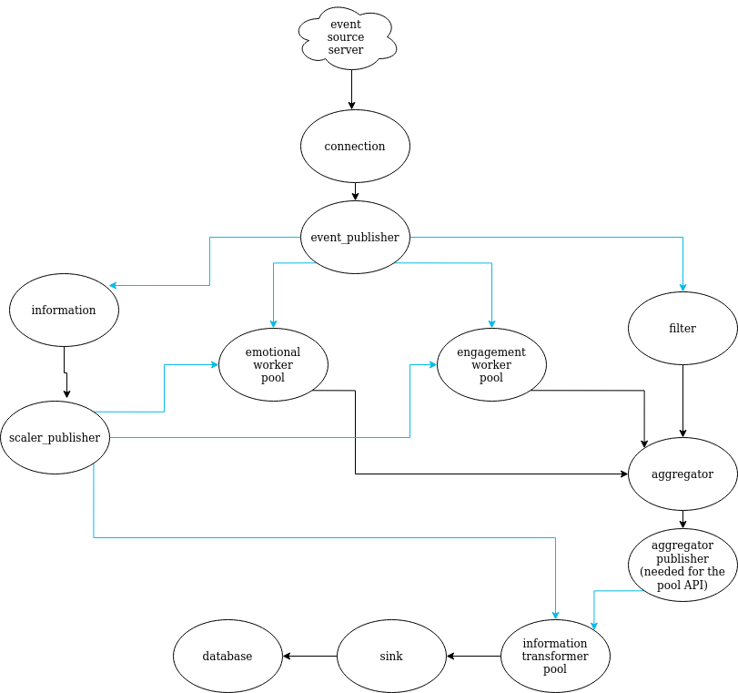
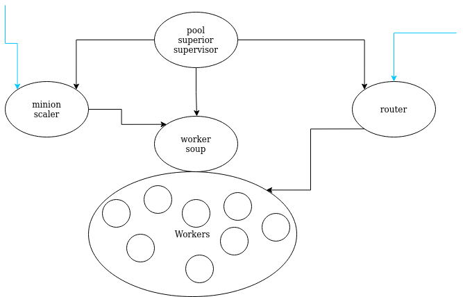

# twitter_stream
  
This is an Erlang OTP Application that:
- continues from the [first part](https://github.com/galathinius/real-time-programming/tree/part1/twitter_stream)
- solves the following task: 
Without further ado, the second laboratory task:  
Loading streaming data into a database.  
A backpressure story. 
1. You will have to reuse the first Lab, with some additions.
2. You will be required to copy the Dynamic Supervisor + Workers that compute the sentiment score  
and adapt this copy of the system to compute the Engagement Ratio per Tweet. Notice that some tweets  
 are actually retweets and contain a special field retweet_status​ . You will have to extract it and treat it as 
  a separate tweet. The Engagement Ratio will be computed as: (#favorites + #retweets) / #followers​ .  
3. Your workers now print sentiment scores, but for this lab, they will have to send it to a dedicated aggregator  
actor where the sentiment score, the engagement ratio, and the original tweet will be merged together.  
Hint:  
you will need special ids to recombine everything properly because synchronous communication is forbidden.
4. Finally, you will have to load everything into a database, for example Mongo, and given that writing messages 
 one by one is not efficient, you will have to implement a backpressure mechanism called adaptive batching​​.  
 Adaptive batching means that you write/send data in batches if the maximum batch size is reached, for  
 example 128 elements, or the time is up, for example a window of 200ms is provided, whichever occurs first.  
 This will be the responsibility of the sink actor(s).
5. To make things interesting, you will have to split the tweet JSON into users and tweets and keep them  
in separate collections/tables in the DB.
6. Of course, don't forget about using actors and supervisors for your system to keep it running.
 
     
What was done: 

 
\* with blue lines are the subscriber relations 
they are neccesary for the worker pool described below
  

- This app calculates engagement according to the formula: 
_(#favorites + #retweets) / (#followers +1)_ 
in order to mittigate division by 0 
 
- Besides the retweets, the workers also separate the quote tweets.  
These are retweets with a comment added by the retweeter. 
 
- In order for the aggregator not to get flooded by empty or panic events from the server,  
the events go through a filter which also separates the retweets and quote tweets. 
*Update: the filter is also a pool  

 
- As the tweets from the aggregator need to be rearranged before getting to the sink,  
they had to go through an _information_transformer_  
 
 - Because the _information_transformer_ part can be considered resource intensive,  
 it was also given a worker pool 
  

 Worker pool structure: 

  

On starting the pool superior supervisor, 2 parameters are given: 
1. the publisher of information that the pool will get information from 
2. the worker file name 
 
Next: 
- the pool router subscribes to the given information publisher, and on updates, distributes the work 
- the pool minion scaler subscribes to the main scaler for hiring updates and scales the number of workers accordingly 
  

 Now, PubSub: 

  
   

  The PubSub pattern was implemented when it was observed that an actor needed to update  
  multiple other actors of something:

   
  First is the event source: 
As a lot of actors need the events, it was decided that a single router can be easily  
overwhelmed, so an event publisher was created. 
Its subscribers are: 
1. the information actor (just counts them) 
2. the filter (for the aggregator) 
3. the emotional router (from the pool) 
4. the engagement router (from the pool) 
 
Second is the main scaler: 
As there are multiple worker pools (three), and more could be added, it would be redundant to  
add the code for each one to one scaler, so it was made into a publisher. 
  
Third is a victim of the worker pool API: 
As the information transformer pool needs a publisher to subscribe to, the aggregator had to  aquire a publisher.